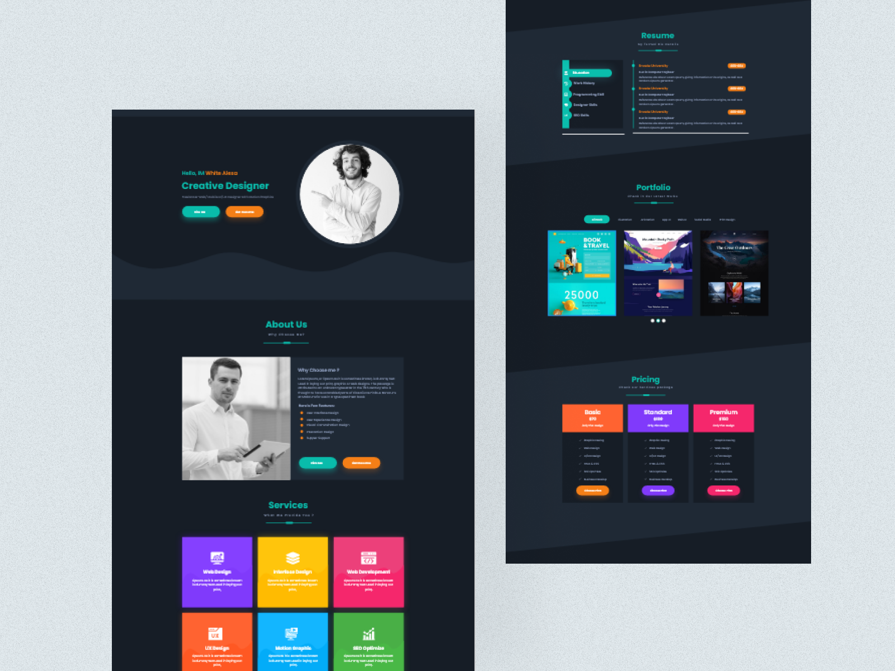
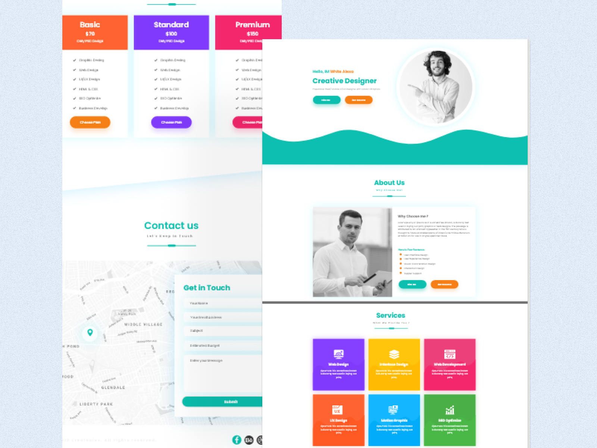

<h1 align="center">In the Name Of God</h1>

- **🌱 Personal Website (Full)**

-  **🆓 Free to the public**

-  **🚀 With a little customization, you can create a website about your resume😊**
 
- - - - - - - - - - - - - - - - - - -  
🛠️  Attributes : 
 
<ul>
  <li>Clean coding and easy to understand for the audience</li>
  <li>Full Responsive (320px to 3840px)</li>
  <li>Beautiful Design and Picture</li>
  <li>Light & Dark Theme Dark Support (Save to blur form website)</li>
</ul>
 
⚒   Language & Tool :
<ul>
  <li>Html</li>
  <li>Css</li>
  <li>Javascript ES6 - ES12</li>
</ul>
▪ ▪ ▪ ▪ ▪ ▪ ▪ ▪ ▪ ▪ ▪ ▪ ▪ ▪ ▪ ▪ ▪ ▪ ▪ ▪ ▪ ▪ ▪ ▪ ▪ ▪ ▪ ▪ ▪ ▪ ▪ ▪ ▪ ▪ ▪ ▪ 
🖼️ Picture :
 
 

 
- - - - - - - - - - - - - - - - - - - 
<h3 align="left">Connect with me:</h3>

    

 
- - - - - - - - - - - - -  - - - - - - 
 
 
Thank you for your beautiful look :) 🤍
  
 
- Developer : <a href="https://www.linkedin.com/in/hekmati-hojjat"><i>Hojjat Hekmatipour</i></a>
